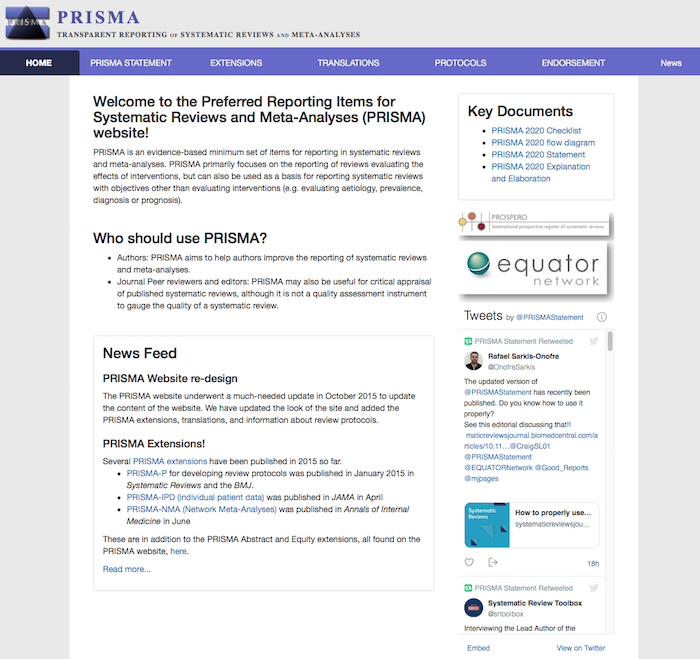

```{r setup, include=FALSE}
knitr::opts_chunk$set(echo = FALSE)
```


# PRISMA

Are you familiar with the "Preferred Reporting Items for Systematic Reviews and Meta-Analyses (PRISMA)" and the associated [website](http://prisma-statement.org)?

Take a few minutes to look into the [website](http://prisma-statement.org/Default.aspx) and read the paper by Page et al. (2021) referenced below (60 minutes), paying particular attention to the checklist and flow diagrams presented. 

Do you recognize important differences or similarities with the CONSORT guidelines discussed in [Session 7](session7.html)? 

[](http://prisma-statement.org/)

### Additional task

Pick a systematic literature search and/or meta-analysis that you are familiar with or search for one using an literature database of your choice. To what extent does the report follow the PRISMA guidelines? 

### Recommended Reading

Page, M. J., McKenzie, J. E., Bossuyt, P. M., Boutron, I., Hoffmann, T. C., Mulrow, C. D., et al. (2021). The PRISMA 2020 statement: An updated guideline for reporting systematic reviews. BMJ, 372, n71. [http://doi.org/10.1136/bmj.n71](https://github.com/matarui/ebdm/raw/main/docs/literature/Page_2021_BMJ.pdf)