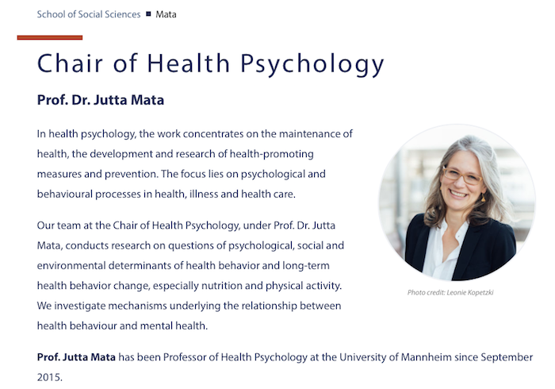

```{r setup, include=FALSE}
knitr::opts_chunk$set(echo = FALSE)
```


# Can psychology save lives?

In this session, [Prof. Dr. Jutta Mata](https://www.sowi.uni-mannheim.de/en/mata/), University of Mannheim, will join us to tell us about how psychology can save lives! Jutta will also be available to answer questions about her work on health interventions and her role as a scientific expert in academic and non-academic contexts. 

Please prepare 1 to 2 questions based on what you have learned throughout the semester about evidence-based decision making. 

[](https://www.sowi.uni-mannheim.de/en/mata/)
