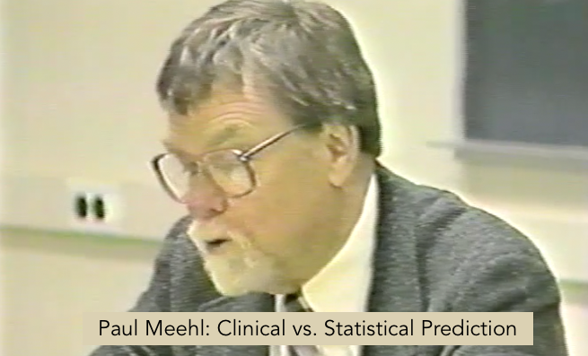

```{r setup, include=FALSE}
knitr::opts_chunk$set(echo = FALSE)
```


# Do algorithms make better decisions?

Paul Meehl was a pioneer in proposing the use of algorithmic decision-making in many areas of psychology, including clinical diagnosis and prognosis. 

In this session we will discuss Meehl's proposals and its implications for applied practice in the behavioral sciences and society at large. Please read the recommended reading below by **Dawes, Faust, and Meehl (1989)** (ca. 60 minutes) for an overview of this work. 

### Recommended Reading

Dawes, R. M., Faust, D., & Meehl, P. E. (1989). Clinical versus actuarial judgment. *Science, 243*(4899), 1668–1674. [http://doi.org/10.2307/1703476](https://github.com/matarui/ebdm/raw/main/docs/literature/Dawes_1989_Science.pdf)

### Optional: Paul Meehl on "Clinical vs. Statistical Prediction"

If you'd like, you can also travel back to 1989 by clicking on the image below (ca. 27 minutes; SWITCHtube link) to experience a portion of Meehl's [lecture](http://meehl.umn.edu/talks/philosophical-psychology-1989) at the University of Minnesota in which he introduces the issue of clinical vs. statistical prediction. 

[](https://tube.switch.ch/videos/ZRIInuhDO5)

### Optional: Exercise

Session 3 provided an introduction to algorithmic decision-making, including a tour of the lens model and policy capturing. 

If you'd like to get a short "hands-on" intro to conducting "policy capturing" yourself, I suggest you participate in the online experiment [“Job or Not?”](https://evidencebaseddm.formr.org) and then, using your own responses (or those of your colleagues), answer the three questions listed [here](lens_model.html).

If you'd like to see a set of solutions, click [here](lens_model_solutions.html).
