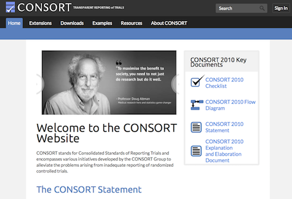

```{r setup, include=FALSE}
knitr::opts_chunk$set(echo = FALSE)
```


# Standards...

Experiments are often said to be the gold standard for causal inference. But what are key aspects of experimental studies and how should they be reported?

Are you familiar with the "Consolidated Standards of Reporting Trials" (CONSORT) and the associated [website](http://www.consort-statement.org)?

Take a few minutes 30-60 minutes to look into the website, the history of CONSORT, and, most importantly, the CONSORT [checklist](http://www.consort-statement.org/download/Media/Default/Downloads/CONSORT%202010%20Checklist.doc). Do you find the checklist helpful? Which items of the checklist do you find most important, and why?

[](http://www.consort-statement.org)

# An example of the importance of understanding RCTs

You have probably have heard of the efficacy of different vaccines. But what does the "efficacy rate" actually mean? 
Check out the video below to help discuss when/how the results of RCTs can be useful!

<iframe width="560" height="515" src="https://www.youtube.com/embed/K3odScka55A" title="YouTube video player" frameborder="0" allow="accelerometer; autoplay; clipboard-write; encrypted-media; gyroscope; picture-in-picture" allowfullscreen></iframe>