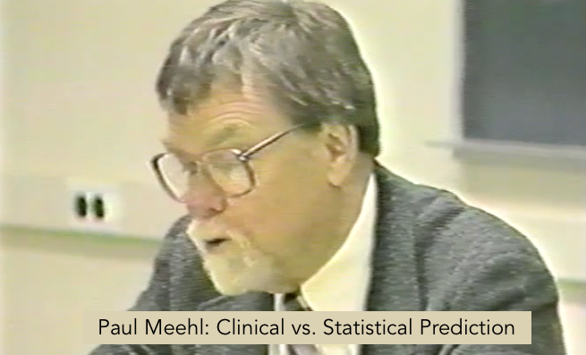

```{r setup, include=FALSE}
knitr::opts_chunk$set(echo = FALSE)
```


## Background Video

### Paul Meehl

Paul Meehl was a pioneer in proposing the use of algorithmic decision-making in many areas of psychology, including clinical diagnosis and prognosis. He introduced the distinction between clinical and actuarial (algorithmic) judgment or prediction.

Travel back to 1989 and experience a portion of Meehl's lecture at the University of Minnesota in which he introduces the issue of clinical vs. statistical prediction - click on the image below to find the lecture Philosophical Psychology Session #09, starting at timestamp 1:14:00).  

[](https://mediasite.csom.umn.edu/Mediasite/Play/682c9b2845514cf5b5a7d1b6defb9e171d)

## Required Reading

In this session we will discuss Meehl's proposals and its implications for applied practice in the behavioral sciences and society at large. Please read the recommended reading below by **Dawes, Faust, and Meehl (1989)** (ca. 60 minutes) for an overview of Meehl and related work. 

Dawes, R. M., Faust, D., & Meehl, P. E. (1989). Clinical versus actuarial judgment. *Science, 243*(4899), 1668–1674. [http://doi.org/10.2307/1703476](https://github.com/matarui/ebdm/raw/main/docs/literature/Dawes_1989_Science.pdf)

## Session Slides

{width=700px height=500px}

<!--## Additional Resources 

### Exercise

This session provides an introduction to algorithmic decision-making, including a tour of the lens model and policy capturing. If you'd like to get a short "hands-on" intro to conducting "policy capturing" yourself, I suggest you participate in the online experiment [“Job or Not?”](https://evidencebaseddm.formr.org) and then, using your own responses (or those of your colleagues), answer the three questions listed [here](lens_model.html).

If you'd like to see a set of solutions, click [here](lens_model_solutions.html).-->

<!-- ### Background Reading -->

<!-- Are you interested in a scathing critique of clinical prediction? This classic could be of interest...  -->

<!-- Dawes, R. (1994). *House of cards: Psychology and psychotherapy built on myth*. New York: Free Press. -->

