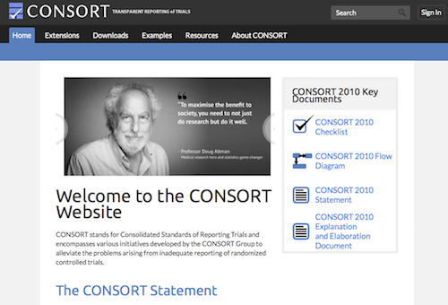

```{r setup, include=FALSE}
knitr::opts_chunk$set(echo = FALSE)
```


## Session Preparation

### What is a Randomized Control Trial?

Randomized control trials are a type of experiment and are often said to be the gold standard for causal inference. Check this video of the Medical Research Council for a short introduction to RCTs (5 minutes). 

<iframe width="560" height="515" src="https://www.youtube.com/embed/U6kVlRn6G0w" frameborder="0" allow="accelerometer; autoplay; clipboard-write; encrypted-media; gyroscope; picture-in-picture; web-share" allowfullscreen></iframe>

### Consolidated Standards of Reporting Trials (CONSORT)

What are key aspects of RCT trials and how should they be reported? Are you familiar with the "Consolidated Standards of Reporting Trials" (CONSORT)? 

Please note that the [CONSORT](http://www.consort-statement.org) website has been down for a few days now – please use [alternative](https://www.equator-network.org/2023/03/01/consort-and-prisma-websites-down-alternative-ways-to-access-the-checklists/) websites to learn about CONSORT and associated materials. Specifically, pleas take a few minutes (30-60 minutes) to look into the the history of CONSORT, and, most importantly, the CONSORT [checklist](https://www.goodreports.org/reporting-checklists/consort). Do you find the checklist helpful? Which items of the checklist do you find most important, and why?

[](http://www.consort-statement.org)

## Session Slides

{width=700px height=500px}

## Additional Resources

### Further Reading

Are you interested in the history and development of RCTs? This piece provides an interesting historical overview, including some discussion of limitations of RCTs. 

Bothwell, L.E., Greene, J.A., Podolsky, S.H., & Jones, D.S. (2016). Assessing the gold standard - Lessons from the history of RCTs. *New England Journal of Medicine, 2*, 374(22):2175-81. [doi: 10.1056/NEJMms1604593.](https://github.com/matarui/ebdm/raw/main/docs/literature/Bothwelletal_2016_NEJM.pdf)