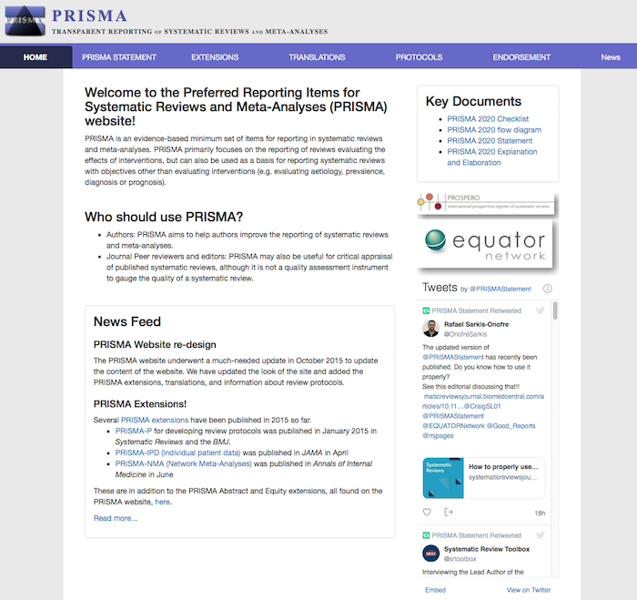

```{r setup, include=FALSE}
knitr::opts_chunk$set(echo = FALSE)
```


  
## Background Video

### Bias detection

Watch this short introduction to bias detection in meta-analysis (ca. 15 minutes).

<iframe width="560" height="315" src="https://www.youtube.com/embed/sjLCt4NxJJY?si=JzMWH9zmEUpgpxv6" title="YouTube video player" frameborder="0" allow="accelerometer; autoplay; clipboard-write; encrypted-media; gyroscope; picture-in-picture; web-share" allowfullscreen></iframe>

## Required Reading

Take a few minutes to look into the [website](http://prisma-statement.org/Default.aspx) and read the paper by **Page et al. (2021)** (60 minutes), paying particular attention to the checklist and flow diagrams presented. 

Do you recognize important differences or similarities with the CONSORT guidelines? 

[](http://prisma-statement.org/)

## Session Slides

{width=700px height=500px}

<!-- ## Additional Resources -->

<!-- For a historical perspective on the development of a central form of research synthesis: meta-analysis.  -->

<!-- Hunt, M. (1997). *How Science Takes Stock: The Story of Meta-Analysis*. Russell Sage Foundation.  -->
